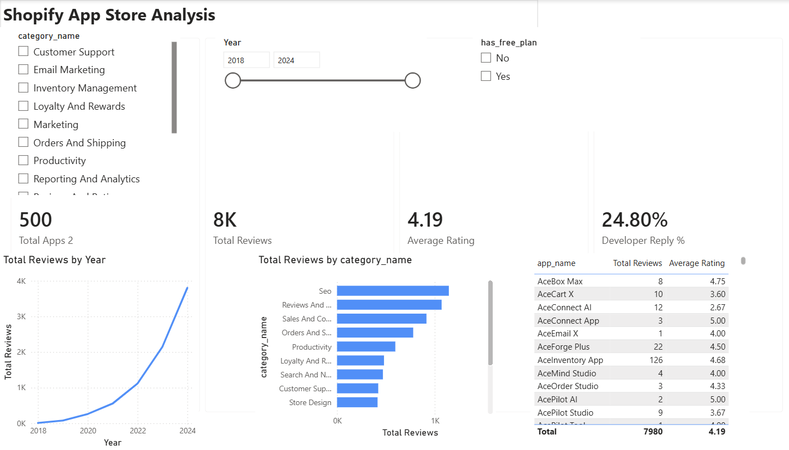
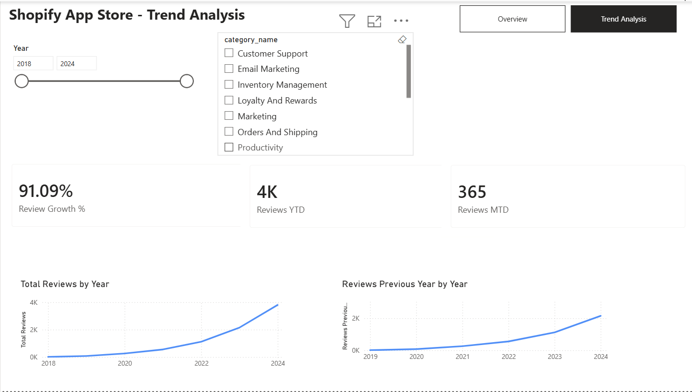

# Shopify App Store Analysis

## 📌 Project Overview

This project analyzes Shopify App Store applications and customer reviews to understand **customer satisfaction, developer engagement, and changes in review activity over time**.

The analysis was created in Power BI and includes an **Overview** dashboard and a **Trend Analysis** dashboard. Together, these dashboards provide a high-level view of marketplace performance and highlight opportunities to strengthen the customer and developer experience.

---

## 🔎 Key Insight

The Shopify App Store analysis includes **500 applications and 7,980 customer reviews**, with an overall average rating of **4.19 out of 5**.

The strong average rating indicates that merchants generally have positive experiences with the applications analyzed. However, only **24.80% of customer reviews received a developer reply**, highlighting a potential opportunity to improve communication between developers and merchants.

Review activity also increased substantially over the reporting period. The analysis shows a **91.09% review growth rate**, with approximately **4,000 reviews YTD** and **365 reviews MTD**. This indicates continued growth in merchant engagement and provides Shopify and app developers with an increasingly valuable source of customer feedback.

---

## 💼 Business Impact

### Strong Customer Satisfaction

The **4.19 average rating** suggests that overall merchant sentiment toward the applications in the dataset is positive.

Maintaining strong customer satisfaction is important for marketplace trust and can support continued merchant engagement with Shopify applications.

### Opportunity for Greater Developer Engagement

Although customer ratings are strong, the **24.80% developer reply rate** shows that most reviews do not receive a direct response from developers.

Increasing developer engagement with reviews could create more opportunities to:

- Address merchant concerns
- Clarify questions or issues
- Demonstrate responsiveness
- Strengthen relationships with merchants

### Growing Customer Feedback

The **91.09% review growth rate** demonstrates that customer review activity is increasing.

As review activity grows, customer feedback becomes an increasingly valuable source of information for understanding merchant experiences and identifying areas where the App Store experience could be improved.

---

## 💡 Recommendations

### 1. Encourage Developers to Respond to Reviews

Shopify should encourage app developers to respond more consistently to customer reviews.

A higher response rate could improve communication between developers and merchants and provide developers with more opportunities to address concerns directly.

### 2. Continue Monitoring Customer Satisfaction

Shopify should continue monitoring average ratings and review activity to identify changes in merchant sentiment.

Tracking these metrics over time can help identify emerging customer experience trends.

### 3. Monitor Review Activity by Category

Review activity should also be evaluated across app categories.

Understanding which categories generate higher levels of customer engagement can help Shopify and developers identify areas receiving significant merchant attention.

### 4. Use Customer Feedback to Identify Opportunities

As review volume continues to grow, Shopify and developers can use customer feedback to identify recurring concerns, areas of satisfaction, and opportunities to improve applications and the overall App Store experience.

---

# 📊 Dashboard

The Power BI report contains two interactive pages.

## Overview

The **Overview** dashboard provides a high-level summary of Shopify App Store activity.

### Key Performance Indicators

| KPI | Result |
|---|---:|
| Total Apps | 500 |
| Total Reviews | 7,980 |
| Average Rating | 4.19 |
| Developer Reply % | 24.80% |

The dashboard allows stakeholders to quickly understand the overall size of the marketplace, customer review activity, satisfaction levels, and developer engagement.

---

## Trend Analysis

The **Trend Analysis** dashboard focuses on changes in review activity over time.

### Key Metrics

| Metric | Result |
|---|---:|
| Review Growth | 91.09% |
| Reviews YTD | Approximately 4,000 |
| Reviews MTD | 365 |

The trend analysis helps stakeholders understand how customer engagement with Shopify applications has changed over time.

---

# 📷 Dashboard Preview

### Overview Dashboard

### Trend Analysis Dashboard

---

# 📚 Additional Documentation

For technical details about the datasets, data preparation, data model, DAX measures, and project structure, see:

**[Technical Documentation](Technical%20Documentation.md)**
